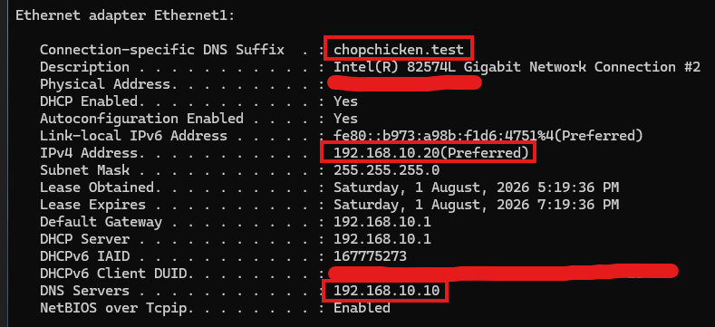
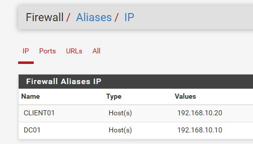
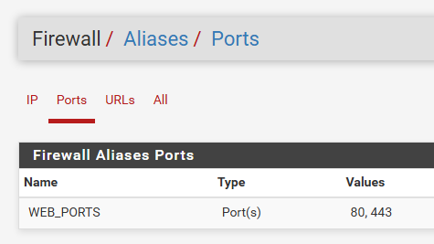
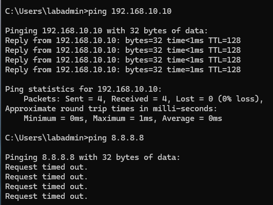
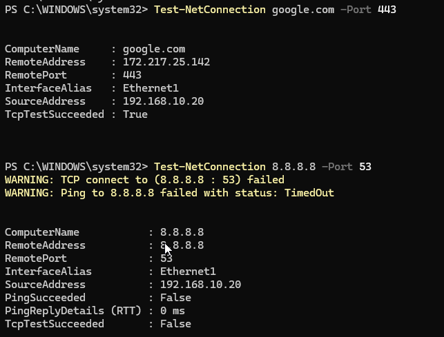
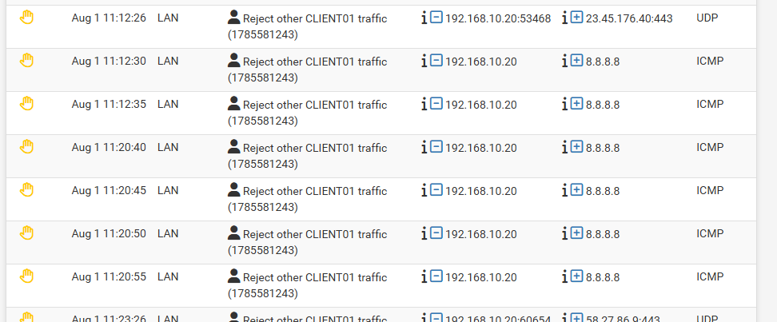
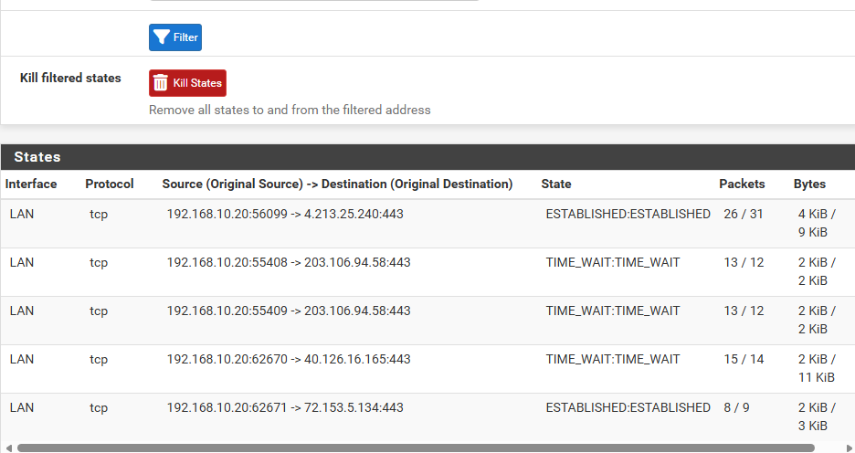
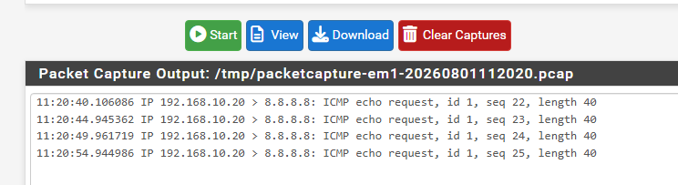
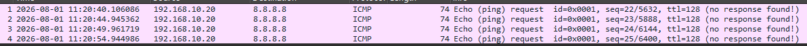

# Exploring pfSense firewall capability

## pfSense DHCP Integration with Active Directory 

Objective :
Configure pfSense to provide DHCP settings automatically to domain clients while using the Active Directory Domain Controller as the DNS server.

|System|Role|Ip Address|
|--|--|--|
|pfSense|Gateway and DHCP Server|192.168.10.1|
|DC01|AD DS and DNS Server|192.168.10.10|
|CLIENT01|Windows Domain Client|192.168.10.20|
|Domain|Active Directory Domain|chopchicken.test|

pfSense now automatically provides IP, gateway, DNS, and domain settings to CLIENT01. Domain clients use DC01 for internal DNS resolution, while DC01 forwards external DNS queries. 

## Creating Firewall Aliases in pfSense

Objective :
Create reusable aliases in pfSense to make firewall and NAT rules easier to read and manage.

Pfsense can display : 
CLIENT01 → WEB_PORTS 

Results :
The aliases were created successfully. They can now be reused across firewall and NAT rules, making the configuration clearer and easier to maintain. 

## Block Internet access for CLIENT01

Create a firewall rules in LAN to block Internet access for CLIENT01

DC01 can be reach but internet is blocked

CLIENT01 may still resolve names such as google.com because its DNS server, DC01, is inside the LAN. However, the actual connection to Google's external IP will be rejected. 

## Allow Only Web Browsing for CLIENT01 
Objective : 
This lab restricts CLIENT01 so it can only access websites using HTTP/HTTPS. 

Open powershell test-NetConnection Command to test connectivity of each port, we can see that CLIENT01 can reach to web port 443, but cant to port 53 DNS.

## Firewall Logs Investigation

CLIENT01 will trying to ping 8.8.8.8 and this is what the pfsense firewall log shows

Filter only CLIENT01 ip and block, you see the ICMP ping got block with applied firewall rules.

You can also check allowed states 

The blocked ping normally will not create a firewall state because pfSense rejected it. The HTTPS connection creates a state because it was allowed. 

DNS traffic from CLIENT01 to DC01 may not appear because both systems are on the same subnet and communicate directly without passing through pfSense. 

Pfsense firewall also can capture traffic 

Wireshark captured four ICMP Echo Requests from CLIENT01 (192.168.10.20) to 8.8.8.8. No Echo Replies were received, confirming that the traffic was prevented from reaching the destination by the pfSense firewall policy. 

